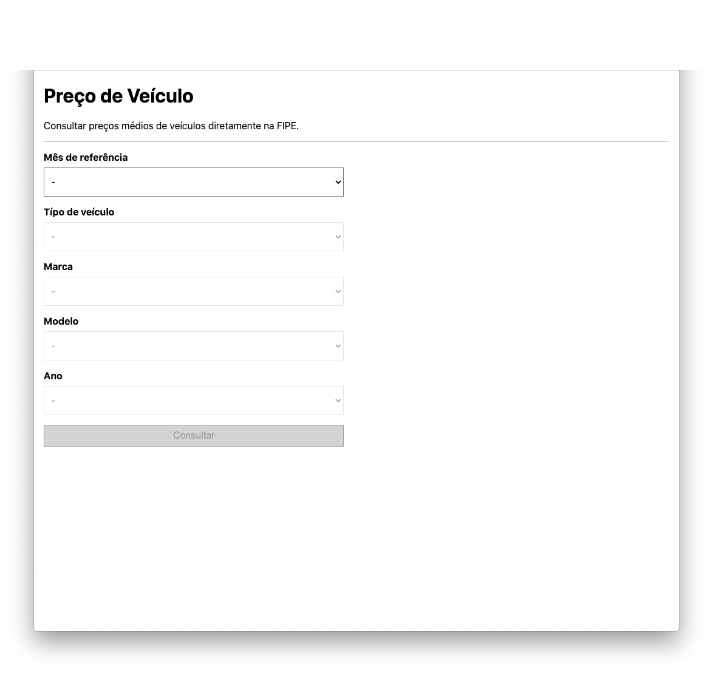
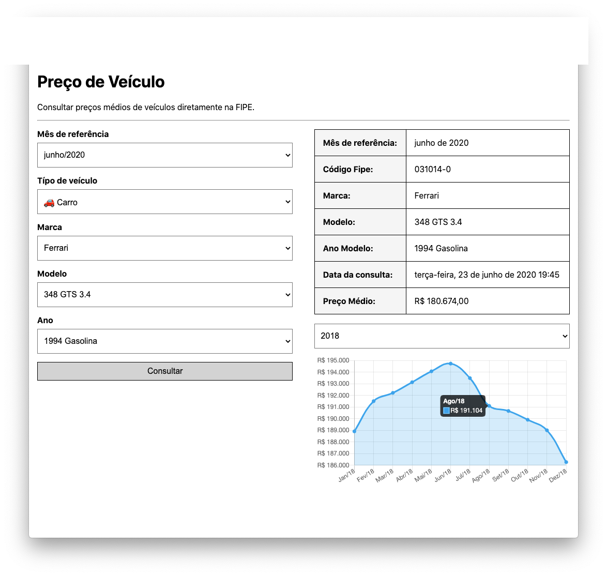

# Preço de Veículo

App para consultar preços médios de veículos diretamente na FIPE.

## Demo

| **Netlify**
|:-----:|:-----:|
| [https://tabelafipe.netlify.app](https://tabelafipe.netlify.app) 





## Docker

Para rodar a aplicação basta executar no terminal

```
docker compose up -d
```

Pronto, agora acesse http://localhost:3000

Mais informações sobre `docker-compose` acesse
https://docs.docker.com/compose/reference

## Autor

- [@CR1ST14ANO](https://github.com/CR1ST14ANO)
